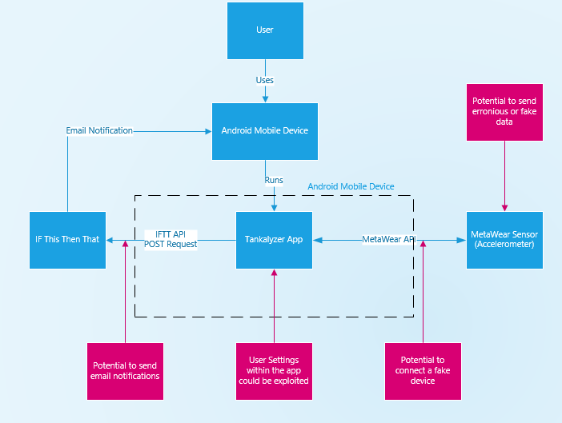

# Tankalyzer

## Executive Summary
What would you do if just your mere presense caused all the fish inside you're fishtank to die spontaniously?  What would you do if just like me you have multiple fish tanks and no matter how much you would like to, you can not sit staring at them all day?  Would you like to know what's going on inside your fishtank at all times?  Well the Tankalyzer is the revolution you have been waiting for!   The Tankalyzer uses sensors to monitor all the equipment on a fish tank and even the fish themselves.

## Project Goals
- Use a MetaWear sensor to detect if the equipment on a fish tank is running.
- Use a MetaWear sensor to detect if the fish inside a fish tank are moving.
- Have an app that allows a user to see the status of a fish tank.

## User Stories
### As a user I want to add equipment to the app so I can nomitor the new equipment
- Be able to tell the app to look for new equipment.
- Have the app find a signature for new equipment.
### As a user I want to see if the equipment on my fish tank is still running, so if it isn't I can fix it.
#### Acceptance Criteria
- Use If This Then That(IFTTT) to send and email notification if a fish is not alive.
- Have an indication that the equipment is still running.

### As a user I want to know if the fish in my fish tank are alive so I can replace non-alive fish.
#### Acceptance Criteria
- Use If This Then That(IFTTT) to send and email notification if a fish is not alive.
- Have an indicator of how many fish are alive.

## Misuser Stories
### As a malicious user I want connect to the app so the tank isn't being monitored
#### Mitigation
- Only pair with the correct device
### As a malicious user I want to send fake data so that the app thinks that equipment is running when it's not.
#### Mitigation
- Only use data from expected sources.
- Filter out erronious sensor data.

## Component List
### User
- A user that wants to use the app to connect their phone to monitor their fish tank with a MetaWear device.
### MetaWear
- Bluetooth device with sensors to be attached to the fish tank.
#### Accelerometer
- Measures acceleration when attached the side of the fish tank.
- Accereration values are used to measure vibrations.
- Vibrations are used to determine what equipment is attached to the fish tank and when it isn't running.
### Android Mobile Device
#### Samsung Galaxy S8+
- SM-G955U
- Used to connect to the MetaWear sensor.
### Tankalyzer App
- Collects data from the MetaWear sensor.
- Alalyses the collected data to determine if equipment on the fish tank is functioning
### MetaWear API
- MetaWear API is used to collect accelerometer data from a paired MetaWear sensor.
### If This Then That (IFTTT) API
- Ise the IFTTT API to send an email notification if an event occours.

## Security Analysis
The app uses a number of different APIs that  allow for possible attack vectors that could impare the functionality of the app, or that could be used maliciously to send fake emails or give the app fake data.

| Component name | Category of vulnerability | Issue Description | Mitigation |
|----------------|---------------------------|-------------------|------------|
| MetaWear API | Unauthorized Access | A fake device can be connected to the mobile device such that the app would use the metawear API to collect data from the fake device | The app should only collect data from devices that is explicitly told to |
| IFTTT API | Unauthorized Access | This API for If This Then That sends email notifications to the user through the IFTTT API, and if exploited can send erronious messages | The API key that IFTTT uses should be stored securely so that it is unable to be misused|
| User Settings | Code Injection | The user settings in the app such as email are a vector that could be used as an attack| User inputs need to be sanatized before it is used so that no malicious code is able to be run
